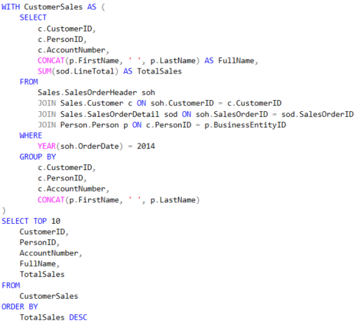
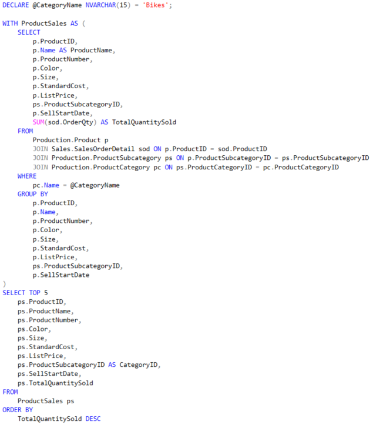

# 📊 AdventureWorks SQL BI Project

A practical SQL project using Microsoft's AdventureWorks2019 database to answer real business questions using advanced querying techniques.

---

## 🧠 Business Questions Answered

1. Products that were never purchased  
2. Top 10 customers by sales (2014)  
3. 5 best-selling products in a given category  
4. Top 10 European customers by number of orders  
5. And more...

---

## 🛠 Technologies Used

- SQL Server Management Studio (SSMS)
- T-SQL with CTEs and Window Functions
- AdventureWorks2019 database

---

## 📂 Files

- `adventureworks_queries.sql` – all SQL queries
- `screenshots/` – visual proof of query results
- `README.md` – this documentation

---

<<<<<<< HEAD
## 📸 Screenshots of SQL Queries
=======
## 📸  Example
>>>>>>> 10b6af3c1956ac64d0704a42f5c4072ca6bd9d34

### 1. 🧪 Products That Were Never Purchased

---

### 2. 🧾 Top 10 Customers by Total Sales (2014)

---

### 3. 🚴‍♂️ Top 5 Best-Selling Products in a Category

---

### 4. 🌍 Top 10 European Customers by Number of Orders
